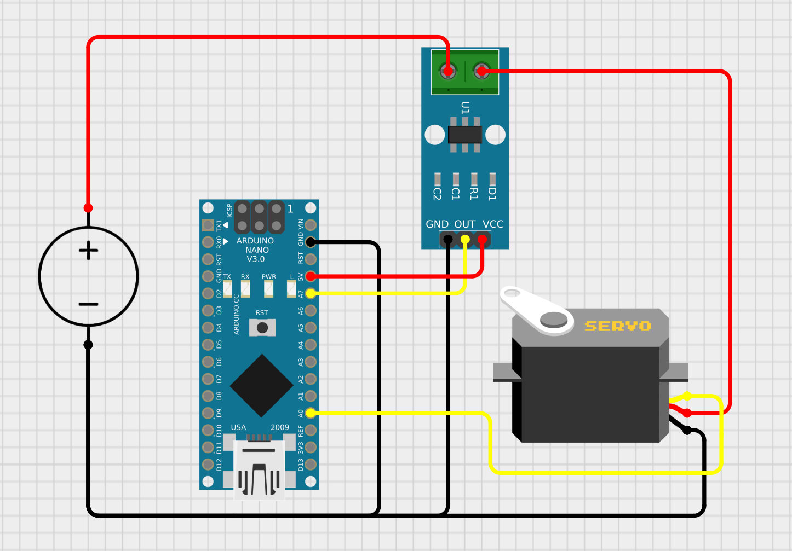

# Gripper Overcurrent Protection

This page explains how to modify the servo gripper to add overcurrent
protection.

## Why?

When the servo gripper is commanded to close on a solid object, the object may
prevent the gripper from reaching its target position. In such cases, the servo
gripper stalls and consumes maximum current, which can cause it to overheat and
become damaged. To prevent this, the servo gripper can be equipped with a
current sensor to measure the current flow. The gripper driver can then
dynamically adjust the commanded position when overcurrent is detected.

## Schematic

An [ACS712 5A](https://www.amazon.ca/dp/B00XT0PLXE) current sensor is added to
the gripper as shown in the schematic below:

## Enabling the Feature in Software

To enable gripper overcurrent protection, set `use_overcurrent_protection` to
`true` in the
[gripper_driver.yaml](../annin_ar4_driver/config/gripper_driver.yaml)
configuration file.

The ACS712 module is available in 3 different versions: 5A, 20A, and 30A. If you have the 20A or 30A version, set `ACS712_version_current` to `20` or `30` in the
[gripper_driver.yaml](../annin_ar4_driver/config/gripper_driver.yaml)
configuration file.

Parameters for tuning this feature can be found in
[gripper_overcurrent_protection.hpp](../annin_ar4_driver/include/annin_ar4_driver/gripper_overcurrent_protection.hpp).
